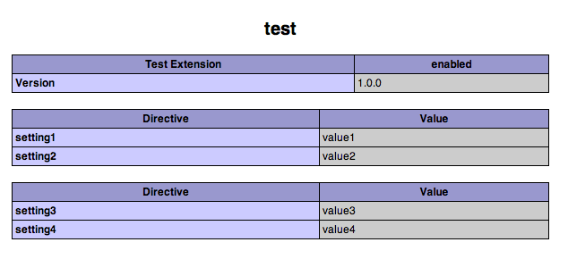

# Phpinfo() sections

Like most extensions, Zephir extensions are able to show information in the [phpinfo()](https://php.net/manual/en/function.phpinfo.php) output. This information is usually related to directives, environment data, etc.

By default, every Zephir extension automatically adds a basic table to the `phpinfo()` output showing the extension version, and any INI options the extension supports.

You can add more directives by adding the following configuration to the `config.json` file:

```json
"info": [
    {
        "header": ["Directive", "Value"],
        "rows": [
            ["setting1", "value1"],
            ["setting2", "value2"]
        ]
    },
    {
        "header": ["Directive", "Value"],
        "rows": [
            ["setting3", "value3"],
            ["setting4", "value4"]
        ]
    }
]
```

This information will be shown as follows:



## Adding INI directives

INI directives come from the `globals` section of `config.json` rather than from a section of their own: every scalar extension global is registered as a directive and listed by `phpinfo()` automatically. See the [extension globals](globals.md#ini-directives) chapter for the directive names, the `ini-entry` key that overrides them, and which types are covered.
